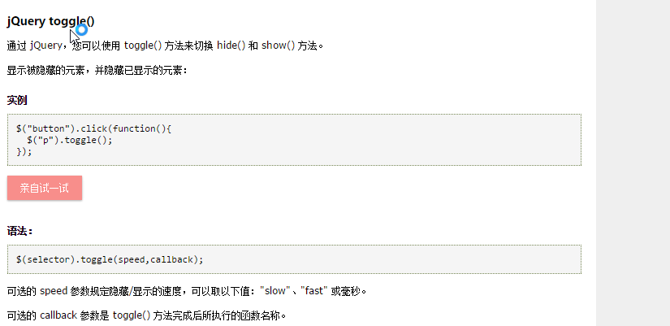

#简单的jquery练习


## 学习记录
### 基本语法：


### 文档准备就绪：


### 简单的选择器：


### 注意：


### 简单时间处理函数：


### toggle简单使用：




#### 代码实现：
```html
<!DOCTYPE html>
<html>
<head>
<script src="/jquery/jquery-1.11.1.min.js"></script>
<script type="text/javascript">
$(document).ready(function(){
  $("button").click(function(){
  $("p").toggle();
  });
});
</script>
</head>
<body>
<button type="button">切换</button>
<p>这是一个段落。</p>
<p>这是另一个段落。</p>
</body>
</html>
```


### jquery中ajax的使用


### get和post请求


## 学习jquery的网站
[W3Cschool的jquery学习](http://www.w3school.com.cn/jquery/index.asp)